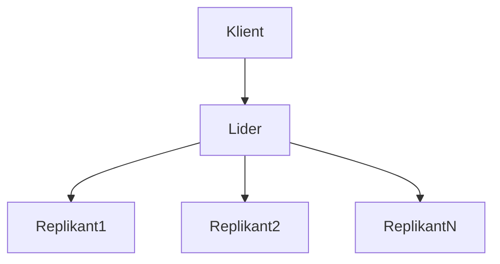

# Rozproszona baza danych klucz-wartość oparta na algorytmie Raft

## PSI - RaftKVDB

## Treść zadania
Celem projektu jest zaprojektowanie i zaimplementowanie rozproszonej bazy danych klucz-wartość wykorzystującej algorytm konsensusu Raft. 

Baza powinna pozwalać na odczytanie, zapisanie i usunięcie wartości przechowywanej pod danym kluczem za pomocą prostego interfejsu wiersza poleceń.
Baza powinna obsługiwać dodawanie oraz usuwanie instancji “na żywo”, w trakcie działania.

Komunikacja klientów z bazą za pomocą TCP.


## Przyjęte założenia funkcjonalne i niefunkcjonalne

### Funkcjonalne
- Operacje CRUD (Create, Read, Update, Delete) na danych w formacie klucz-wartość.
- Wykorzystanie algorytmu konsensusu Raft do synchronizacji danych między instancjami i wyboru lidera klastra.
- Wszystkie operacje zapisu są kierowane do lidera, który synchronizuje dane z pozostałymi instancjami (replikami).
- Wszyscy użytkownicy mają równe uprawnienia do wykonywania operacji na bazie danych.
- Połączenie z bazą danych realizowane za pomocą komendy `nc` (Netcat).
- Komunikacja między klientem a bazą danych za pomocą protokołu TCP.
- Mechanizm replikacji danych zapewniający spójność w przypadku awarii węzłów.

### Niefunkcjonalne
- Wysoka dostępność systemu.
- Małe opóźnienie dla operacji odczytu.
- Spójność danych, nawet w przypadku awarii lub utraty połączenia z niektórymi instancjami.
- Informacje o błędach dla klienta i administratorów

## Podstawowe przypadki użycia

1. **Połączenie z bazą danych**  
   Użytkownik łączy się z bazą danych za pomocą komendy `nc`. Po nawiązaniu połączenia może wykonywać operacje na bazie.  

   **Przykład**:  
   Komenda w terminalu: `nc 127.0.0.1 5000`  

2. **Dodanie nowej wartości do bazy danych**  
   Użytkownik wprowadza parę klucz-wartość za pomocą interfejsu wiersza poleceń. Wartość jest zapisywana w bazie danych, a lider synchronizuje ją z replikami w klastrze.  

   **Przykład**:  
   Komenda: `put key1 value1`  
   Odpowiedź: `SUCCESS: key1 -> value1 added.`  

3. **Odczytanie wartości przypisanej do klucza**  
   Użytkownik zapytuje o wartość przypisaną do określonego klucza. System zwraca wartość z bazy danych, zapewniając, że pochodzi ona ze spójnego stanu.  

   **Przykład**:  
   Komenda: `get key1`  
   Odpowiedź: `key1 -> value1`  

4. **Zaktualizowanie istniejącej wartości**  
   Użytkownik zmienia wartość przypisaną do istniejącego klucza. Nowa wartość jest zapisywana w bazie danych, a zmiany są synchronizowane między replikami.  

   **Przykład**:  
   Komenda: `update key1 value2`  
   Odpowiedź: `SUCCESS: key1 updated to value2.`  

5. **Usunięcie pary klucz-wartość**  
   Użytkownik usuwa określoną parę klucz-wartość z bazy danych. System usuwa dane z lidera i synchronizuje zmiany z replikami.  

   **Przykład**:  
   Komenda: `delete key1`  
   Odpowiedź: `SUCCESS: key1 removed.`  

6. **Dodanie nowej instancji do klastra**  
   Administrator dodaje nową instancję do klastra podczas działania systemu. Nowa instancja zostaje zsynchronizowana z liderem i zaczyna przechowywać spójny stan danych.  

   **Przykład**:  
   Komenda: `add-node 192.168.1.2`  
   Odpowiedź: `SUCCESS: Node 192.168.1.2 added to cluster.`  

7. **Usunięcie instancji z klastra**  
   Administrator usuwa instancję z klastra. System przestaje uwzględniać instancję w procesie replikacji.  

   **Przykład**:  
   Komenda: `remove-node 192.168.1.3`  
   Odpowiedź: `SUCCESS: Node 192.168.1.3 removed from cluster.`  


8. **Sprawdzenie stanu klastra**  
   Użytkownik uzyskuje informacje o aktualnym stanie klastra, takich jak lista aktywnych instancji, lider klastra, oraz status synchronizacji.  

   **Przykład**:  
   Komenda: `status`  
   Odpowiedź:  
   ```  
   Cluster Status:  
   Leader: 192.168.1.1  
   Active Nodes: [192.168.1.1, 192.168.1.2, 192.168.1.3]  
   Sync Status: All nodes in sync.  
   ```  

## Analiza możliwych sytuacji błędnych i proponowana ich obsługa

1. **Brak połączenia z liderem klastra**  
   - **Sytuacja:** Klient próbuje wykonać dowolná operację, ale lider jest niedostępny.  
   - **Proponowane rozwiązanie:** System automatycznie przeprowadza wybór nowego lidera, a klient otrzymuje informację o konieczności ponowienia zapytania.  
   **Odpowiedź:** `ERROR: Leader unavailable. Retrying...`  

2. **Utrata synchronizacji przez replikę**  
   - **Sytuacja:** Jedna z replik przestaje synchronizować dane z liderem.  
   - **Proponowane rozwiązanie:** Replika wchodzi w tryb przywracania i próbuje zsynchronizować dane. W przypadku niepowodzenia użytkownik otrzymuje ostrzeżenie o potencjalnej niespójności danych.  
   **Odpowiedź:** `WARNING: Node 192.168.1.3 out of sync.`  

3. **Niepoprawny format danych wejściowych**  
   - **Sytuacja:** Klient przesyła zapytanie w nieprawidłowym formacie (np. brak klucza lub wartości).  
   - **Proponowane rozwiązanie:** System zwraca komunikat o błędzie i wskazuje poprawny format komendy.  
   **Odpowiedź:** `ERROR: Invalid command format. Usage: put <key> <value>`  

4. **Próba wykonania operacji na nieistniejącym kluczu**  
   - **Sytuacja:** Klient próbuje odczytać lub usunąć klucz, który nie istnieje w bazie.  
   - **Proponowane rozwiązanie:** System informuje klienta, że klucz nie został znaleziony.  
   **Odpowiedź:** `ERROR: Key not found.`  

## Wybrane środowisko sprzętowo-programowe

### Systemy operacyjne
- Docelowe środowisko niezależne od platformy, z możliwością uruchomienia na Linuxie dzięki wykorzystaniu kontenerów Docker.

### Biblioteki programistyczne
- Python 
- Biblioteka `socket` i `asyncio` (do obsługi komunikacji TCP), `pytest` (do testowania) `raft?` (do implementacji algorytmu Raft) itp.

## Architektura rozwiązania

### Komponenty systemu
1. **Lider (Leader)**  
   - Odpowiedzialny za obsługę wszystkich operacji zapisu (CRUD).
   - Synchronizuje dane z replikami w klastrze.
   - Obsługuje komunikację z klientami.

2. **Repliki (Followers)**  
   - Przechowują kopie danych otrzymane od lidera.
   - Weryfikują stan synchronizacji z liderem.
   - Mogą przejąć rolę lidera w przypadku jego awarii.

3. **Klient**  
   - Umożliwia użytkownikowi wykonywanie operacji na bazie danych.
   - Łączy się z systemem za pomocą protokołu TCP.

---

### Diagram Architektury



### Ewentualnie API modułów stanowiących główne bloki funkcjonalne

System składa się z następujących głównych modułów:
- **Lider (Leader)**: Odpowiada za zarządzanie operacjami zapisu i synchronizację z replikami.
- **Repliki (Followers)**: Przechowują kopie danych i mogą przejąć rolę lidera.
- **Klient**: Umożliwia użytkownikom interakcję z systemem.

API umożliwia komunikację między tymi modułami:

1. **Klient -> Lider**
   - `put <key> <value>`: Dodanie wartości.
   - `get <key>`: Pobranie wartości.
   - `update <key> <value>`: Aktualizacja wartości.
   - `delete <key>`: Usunięcie wartości.

2. **Lider -> Repliki**
   - Synchronizacja operacji: Lider wysyła dane do replik w formacie `(key, value)`.
   - Wiadomości kontrolne: Komunikaty informujące o stanie synchronizacji.

3. **Repliki -> Lider**
   - Potwierdzenie synchronizacji: Repliki informują lidera o statusie operacji.

### Ewentualnie listy komunikatów z określeniem nadawców i odbiorców

| Nadawca  | Odbiorca     | Typ komunikatu                          | Opis                                      |
|----------|--------------|-----------------------------------------|------------------------------------------|
| Klient   | Lider        | `put <key> <value>`                    | Żądanie dodania wartości do bazy.         |
| Klient   | Lider        | `get <key>`                            | Żądanie odczytu wartości.                 |
| Klient   | Lider        | `update <key> <value>`                 | Żądanie aktualizacji wartości.            |
| Klient   | Lider        | `delete <key>`                         | Żądanie usunięcia wartości.               |
| Lider    | Repliki      | `AppendEntries (key, value)`           | Synchronizacja danych z replikami.        |
| Lider    | Repliki      | `Heartbeat`                            | Informacja o żywotności lidera.           |
| Repliki  | Lider        | `Acknowledgment`                       | Potwierdzenie otrzymania danych.          |
| Replika  | Lider        | `RequestVote`                          | Żądanie głosu w procesie wyboru lidera.   |

### Sposób testowania

Testowanie systemu obejmuje:

1. **Testy jednostkowe**  
   - Testowanie operacji CRUD dla lidera i replik.
   - Weryfikacja poprawności implementacji algorytmu Raft (np. wybór lidera).

2. **Testy integracyjne**  
   - Symulacja komunikacji między liderem a replikami.
   - Testowanie synchronizacji danych w scenariuszach awarii i ich naprawy.

3. **Testy wydajnościowe**  
   - Ocena czasu odpowiedzi na operacje CRUD przy zwiększonym obciążeniu.
   - Sprawdzenie stabilności klastra podczas dodawania/usuwania węzłów.

4. **Testy akceptacyjne**  
   - Symulacja realistycznych przypadków użycia, takich jak dodanie nowego węzła do klastra czy odzyskanie synchronizacji po awarii.

5. **Narzędzia używane do testowania**  
   - `pytest`: Framework do testów jednostkowych.
   - Symulacje sieciowe z wykorzystaniem bibliotek Python (`asyncio`, `socket`).

## Podział prac w zespole  

### Mikołaj (Algorytm Raft i synchronizacja):  
- Implementacja algorytmu Raft (wybór lidera, synchronizacja danych, heartbeat).  
- Obsługa dodawania i usuwania instancji z klastra.  

### Ivan (Interfejs klienta i komunikacja TCP):  
- Implementacja komunikacji klient-serwer za pomocą TCP.  
- Tworzenie prostego interfejsu wiersza poleceń (put, get, update, delete).  
- Obsługa błędów komunikacji z klientem.  

### Sofiya (Repliki, testy i dokumentacja):  
- Implementacja działania replik (potwierdzenia synchronizacji, obsługa awarii).  
- Testy jednostkowe i integracyjne dla całego systemu.  
- Przygotowanie dokumentacji technicznej i raportów z testów.  


## Przewidywane funkcje do zademonstrowania w ramach odbioru częściowego  

1. Połączenie klienta z systemem za pomocą protokołu TCP.  
2. Podstawowa obsługa algorytmu Raft:  
   - Wybór lidera i synchronizacja danych między liderem a replikami.  
3. Obsługa operacji CRUD (put, get, update, delete).  
4. Obsługa awarii lidera i wyboru nowego lidera.  
5. Obsługa błędów:  
   - Niepoprawny format komend.  
   - Operacje na nieistniejących kluczach.  


## Plan pracy z podziałem na tygodnie  

### **Do 20 grudnia:**  
- Stworzenie repozytorium projektu na GitLab.  
- Dodanie pliku README z opisem założeń i architektury.  

### **21 grudnia – 30 grudnia:**  
- **Mikołaj:** Rozpoczęcie implementacji algorytmu Raft (wybór lidera, heartbeat).  
- **Ivan:** Stworzenie podstawowej komunikacji klient-serwer za pomocą TCP.  
- **Sofiya:** Opracowanie mechanizmu replikacji danych i przygotowanie testów jednostkowych.  

### **31 grudnia – 10 stycznia:**  
- **Mikołaj:** Dodanie synchronizacji danych między liderem a replikami.  
- **Ivan:** Implementacja obsługi komend klienta (`put`, `get`, `update`, `delete`).  
- **Sofiya:** Testowanie operacji CRUD i synchronizacji w normalnym trybie pracy.  
- Zintegrowanie wszystkich modułów.  
- Przygotowanie demonstracji funkcji do odbioru częściowego.  
- Testy integracyjne i dodanie tagu `alpha` w repozytorium.  

### **11 stycznia – 18 stycznia:**  
- Rozbudowa systemu o obsługę dodawania/usuwania instancji w trakcie działania.  
- Rozwiązanie problemów wykrytych podczas testów częściowych.  

### **21 stycznia – 24 stycznia:**  
- Przygotowanie prezentacji projektu i testów do końcowej demonstracji.  
- Ostateczna integracja i sprawdzenie stabilności systemu w różnych scenariuszach.  
